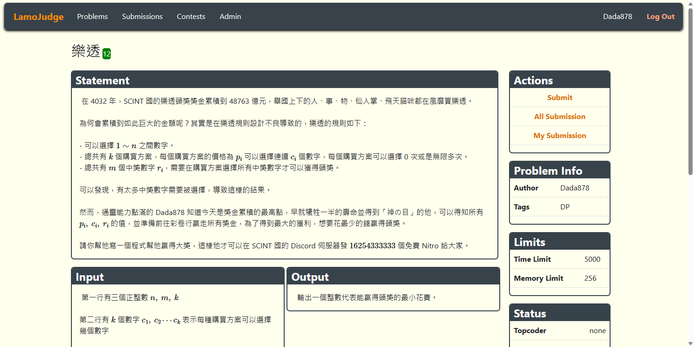

# LamoJudge
## Introduction
一個酷酷的開源 Online Judge

## Getting Started
- 安裝 Python 依賴套件
    ```
    pip install -r requirements.txt
    ```
- 部署 Docker
    ```
    docker build -t judge-sandbox
    docker run judge-sandbox
    ```
- 部屬 MongoDB